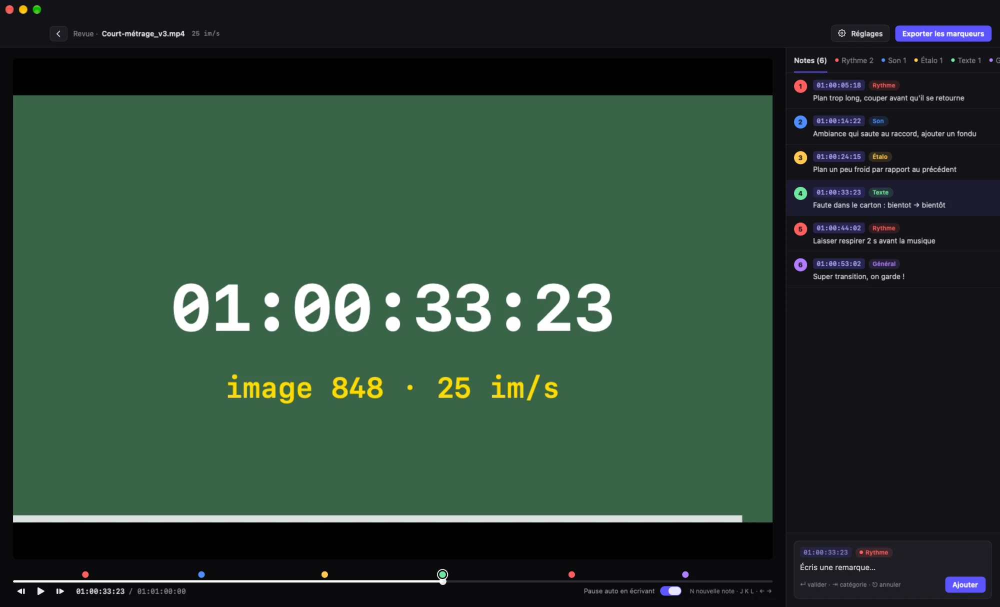
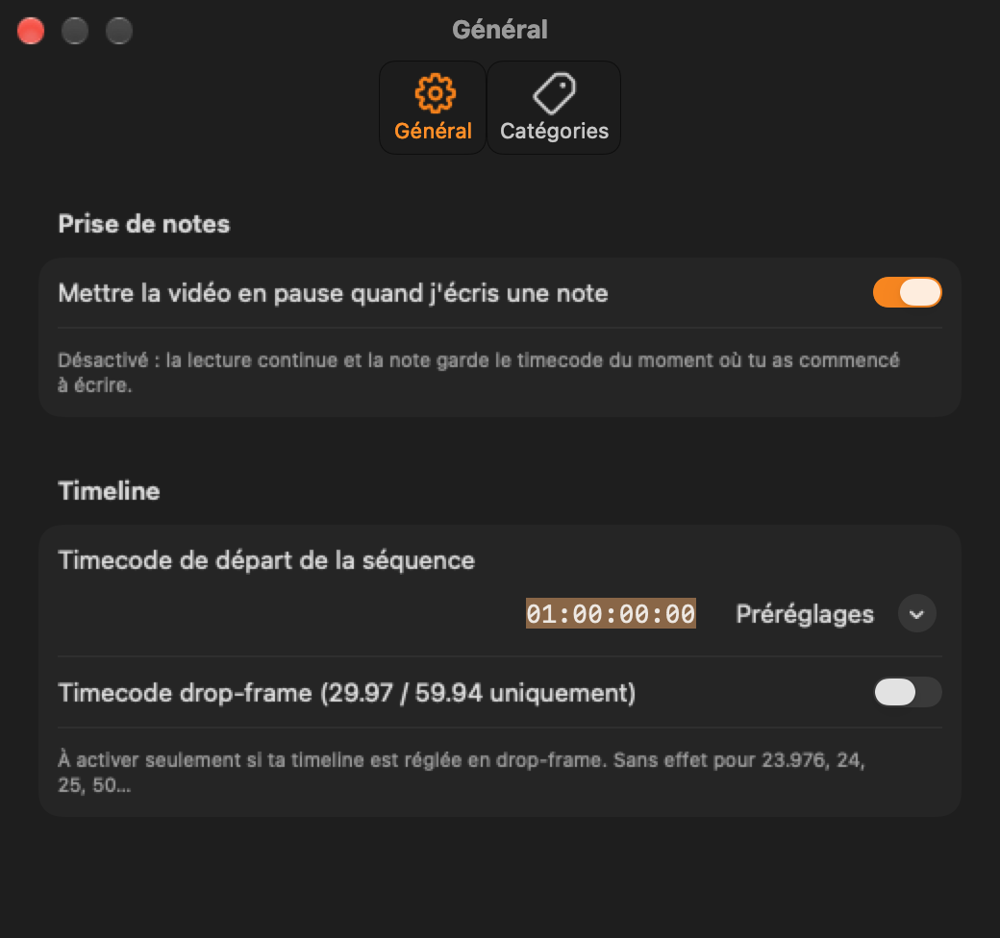

<h1 align="center">🎬 Revue Montage</h1>

<p align="center">
  <b>Take timecoded notes during an edit review,<br>
  then get them back as colored markers in DaVinci Resolve or Premiere Pro.</b>
</p>

<p align="center">
  
  
  <a href="LICENSE"></a>
  <a href="https://ko-fi.com/arthuraw_"></a>
</p>

<p align="center"><a href="README.md">🇫🇷 Français</a> · 🇬🇧 English</p>

<p align="center"></p>

> ℹ️ The app interface is in **French** for now. The shortcuts and workflow below work the same way.

## Why this app?

I built it for two reasons:

1. **It's smoother.** Playing back a longer edit straight from the timeline quickly makes my Mac lag.
   Reviewing a quick export of the sequence in Revue Montage keeps playback smooth, so I can focus on
   the fixes instead of waiting for the timeline to catch up.
2. **It's pleasant to use.** I just like having a nice, practical interface for my edit reviews:
   a player, a list of notes, keyboard shortcuts, nothing more.

When the review is done, the notes go into your editing software as **colored markers, frame-accurate**:
all that's left is to work through them one by one.

## Features

- 🎞️ Drag and drop an `.mp4` / `.mov` export: the frame rate is detected automatically (23.976, 24, 25, 29.97, 50, 59.94…).
- ⌨️ Editor shortcuts: **Space**, **J K L**, **← →** frame by frame.
- 📝 **N** to add a note at the exact timecode, with colored categories (Rhythm, Sound, Grading, Text, General — customizable).
- 💾 Autosave next to the video: reopen the file and your notes are back.
- 📤 Marker export for **DaVinci Resolve** (`.edl`) and **Premiere Pro** (`.json` + import panel).
- ⏱️ Configurable sequence start timecode and drop-frame.

## Installation

**You need:** a Mac running **macOS 14 Sonoma** or later, and Apple's command line developer tools
(run `xcode-select --install` in Terminal if you don't have them).

```bash
git clone https://github.com/heyy-tatious/revue-editing.git
cd revue-editing
./scripts/build-app.sh          # builds dist/Revue Montage.app → drag it into Applications
./premiere-panel/install.sh     # (optional) installs the "Importer les notes" panel in Premiere Pro (25.6+)
```

## During the review

1. Quickly export **the whole sequence** and drop the file into Revue Montage.
2. **Space** play/pause · **← →** frame by frame (⇧ = 10 frames) · **J K L**.
3. **N** (or Return): new note at the current timecode. **Tab** changes the category, **Return** confirms,
   **⌥Return** inserts a line break, **Esc** cancels.
4. Click a note to jump to that moment. Double-click to edit. Right-click for category, re-sync, delete.

Notes are saved automatically to `<video>.revue.json`, next to the video.
Settings (⌘,): auto-pause while typing, sequence start timecode, drop-frame, categories.

<p align="center"></p>

## Export to your editing software

**Exporter les marqueurs ▾** (or ⌘E / ⇧⌘E) writes the file next to the video.

<p align="center"></p>

### DaVinci Resolve

In the Media Pool, right-click the timeline →
*Timelines → Import → Timeline Markers from EDL…* → pick `… marqueurs Resolve.edl`.
The note text becomes the marker name ("[Category] note").
Make sure the **start timecode** in the settings matches your timeline (01:00:00:00 by default).

### Premiere Pro

Open the sequence, then *Window → UXP Plugins → Importer les notes*,
pick `… marqueurs Premiere.json`, then **Ajouter à la séquence active** (add to active sequence).
Category = marker name, note = marker comment. Duplicates are skipped;
press ⌘Z twice to undo the import (colors, then markers).

> Tip: in Premiere's Markers panel, color filters can hide some markers.

## 🤖 Transparency: a "vibe-coded" project

This app was **vibe-coded**: the code was written by an AI (Claude, by Anthropic), based on my ideas,
my testing and my feedback.

The core (timecode math, Resolve and Premiere exports) is covered by automated checks, and I've tested it
in Resolve and Premiere. Bugs may remain, though: if you find one,
[open an issue](https://github.com/heyy-tatious/revue-editing/issues), it really helps.

## ☕ Support the project

Revue Montage is **free and open source**. If it saves you time and you'd like to say thanks,
you can leave a small tip:

<a href="https://ko-fi.com/arthuraw_"></a>

Starring the repo ⭐ or telling other editors about it helps too!

## Contributing

Ideas, bug reports and pull requests are welcome.
For a big change, please open an issue first so we can discuss it.

### Development

```bash
swift run NotesCoreChecks                                   # checks (timecodes, EDL, JSON)
swift scripts/make-test-video.swift test.mp4 25 60 90000    # test video with burned-in timecode
```

- `Sources/NotesCore`: pure logic (timecodes, models, exports).
- `Sources/RevueMontage`: SwiftUI app.
- `premiere-panel/plugin`: UXP panel for Premiere Pro (JavaScript).
- Design doc (French): [`docs/superpowers/specs/2026-09-17-revue-montage-design.md`](docs/superpowers/specs/2026-09-17-revue-montage-design.md).

## License

[MIT](LICENSE): you're free to use, modify and share this software, including commercially,
as long as you keep the license notice.
